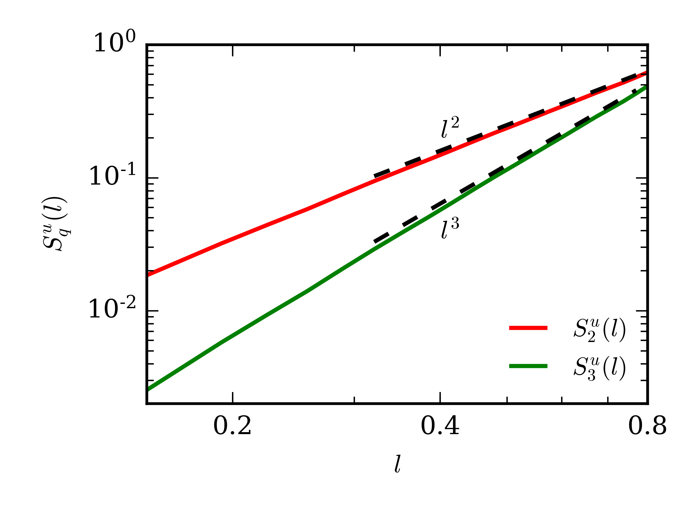
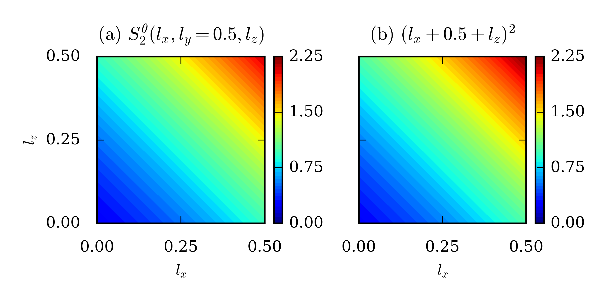

# Testing and Validation of `fastSF`

We validate `fastSF` by comparing the numerical results with analytical results for idealized **u** and *&theta;* fields as well as with the predictions of K41 (Kolmogorov 1941a, 1941b).

### Problem 1

We consider the following 2D velocity and scalar fields: 

**u** = [*x, z*]

*&theta; = x + z*

For the above fields, it can be analytically shown that the longitudinal velocity structure functions and the scalar structure functions are

*Squll = (lx2 + lz2)q/2 = lq*,

*Sq&theta; = (lx + lz)q*.

We run ``fastSF`` to compute the velocity and scalar structure functions for the above fields. The resolution of the fields and the domain size are 322 and 1 x 1 respectively. We plot the second and the third-order longitudinal velocity structure functions versus *l* in Fig.1. Clearly, *S2ull (l)* and *S3ull (l)* equal *l2* and *l3* respectively, consistent with the analytical results. Figure 2 exhibits the density plots of the computed second-order scalar structure function *S2&theta;* (**l**) along with (*lx + lz*)2. The two plots are very similar, thus showing the ``fastSF`` computes the scalar structure function correctly.

 <figure>
  
  <figcaption>Fig.1: For the velocity field defined in Problem 1: plots of the second and third-order longitudinal structure functions vs. l. The second and third-order structure functions equal l2 and l3 respectively.</figcaption>
</figure>
 
<figure>
  
  <figcaption>Fig.2: For the scalar field defined in Problem 1: (a) Density plot of the second-order scalar structure function as function of the displacement vector. (b) Density plot of (lx + lz)2, which is the analytical value of the second-order scalar structure function. The two density plots are very similar.</figcaption>
</figure>

### Problem 2
We consider the following 3D velocity and scalar fields: 

**u** = [*x, y, z*]

*&theta; = x + y + z*

For the above fields, it can be analytically shown that the longitudinal velocity structure functions and the scalar structure functions are

*Squll = (lx2 + ly2 + lz2)q/2 = lq*,

*Sq&theta; = (lx + ly + lz)q*.

We run ``fastSF`` to compute the velocity and scalar structure functions for the above fields. The resolution of the fields and the domain size are 323 and 1 x 1 x 1 respectively. We plot the second and the third-order longitudinal velocity structure functions versus *l* in Fig.3. Clearly, *S2ull (l)* and *S3ull (l)* equal *l2* and *l3* respectively, consistent with the analytical results. Figure 4 exhibits the density plots of the computed second-order scalar structure function *S2&theta;* (*lx, lz*) on *ly* = 0.5 plane, along with (*lx* + 0.5 + *lz*)2. The two plots are very similar, thus showing the ``fastSF`` computes the scalar structure function correctly.

Problems 1 and 2 are used as test cases for the the code. The user is required to execute the shell script `fastSF/runTest.sh` to run the test case. On doing so, the code generates the velocity and the scalar fields as per the above relation. After computing the structure functions, the code computes the percentage difference between the theoretical and the computed values of the structure functions. If the error does not exceed 1 x 10-10, the code is deemed to have passed.

<figure>
  
  <figcaption>Fig.3: For the velocity field defined in Problem 2: plots of the second and third-order longitudinal structure functions vs. l. The second and third-order structure functions equal l2 and l3 respectively.</figcaption>
</figure>

<figure>
  
  <figcaption>Fig.4: For the scalar field defined in Problem 2: (a) Density plot of the second-order scalar structure function as function of the displacement vector on *ly* = 0.5 plane. (b) Density plot of (lx + 0.5 + lz)2, which is the analytical value of the second-order scalar structure function for *ly* = 0.5. The two density plots are very similar.</figcaption>
</figure>

### Problem 3

Here, we consider the classical results of Kolmogorov (Kolmogorov 1941a, 1941b) for 3D incompressible hydrodynamic turbulence with homegeneity and isotropy. In such flows, for the inertial range, which comprises of scales lying between the large-scale forcing regime and the small-scale dissipation regime, the third-order longitudinal velocity structure function is given by 

*S3ull (l)* = -(4/5)*&epsilon;l*, 

where *&epsilon;* is the viscous dissipation rate (Kolmogorov1941a, 1941b; Frisch 1995; Verma 2019). For an arbitrary order *q*, She and Leveque (1994) proposed that the longitudinal structure functions scale as *S3ull (l)* ~ *l&zeta;q*, where the exponent *&zeta;q* is given by 

*&zeta;q* = (*q*/9) + 2 {1 - (2/3)*q*/3 }.

We compute the longitudinal velocity structure functions of *q* = 3, 5, 7 using the simulation data of 3D hydrodynamic turbulence with Reynolds number (Re) of 5700. The simulation was performed using TARANG (Verma et al 2013; Chatterjee et al 2018) on a 5123 grid with the domain size of (2&pi; x 2&pi; x 2&pi;). For more details on the simulation, refer to (Sadhukhan et al 2019). We run ``fastSF`` on Shaheen II to compute the structure functions, employing 4096 MPI processes. 

We normalize the third, fifth, and seventh-order longitudinal velocity structure functions with (*&epsilon;l*)*&zeta;q*, where *&zeta;q* is given by She-Leveque's relation. We plot the negative of these quantities versus *l* in Fig. 5. 
The figure clearly shows that in the inertial range (0.2 < *l* < 0.8), the normalized third-order longitudinal velocity structure function is fairly close to 4/5 (represented by dashed line), consistent with Kolmogorov's theory. Moreover, the normalized fifth and seventh-order structure functions show a plateau for the same range of *l*, thus exhibiting consistency with She-Leveque's model. Note that we expect more accurate results for higher resolution simulations (Verma et al 2013).

The results obtained from Problems 1, 2, and 3 thus validate ``fastSF``. 

<figure>
  
  <figcaption>Fig.5: For 3D homogeneous isotropic turbulence (Problem 3): plots of the negative of normalized third, fifth and seventh-order structure functions vs. l. The negative of the normalized third-order structure function is close to 4/5 (dashed line) in the inertial range..</figcaption>
</figure>

### Bibliography

Chatterjee, A. G., Verma, M. K., Kumar, A., Samtaney, R., Hadri, B., and Khurram, R. (2018). Scaling of a Fast Fourier Transform and a pseudo-spectral fluid solver up to 196608 cores. *J. Parallel Distrib. Comput.*, 113(3), 77-91, doi:10.1016/j.jpdc.2017.10.014

Frisch, U. (1995). *Turbulence: The Legacy of A. N. Kolmogorov*. Cambridge: Cambridge University Press. doi:10.1017/CBO9781139170666

Kolmogorov, A. N. (1941a). Dissipation of Energy in Locally Isotropic Turbulence. *Dokl Acad Nauk SSSR*, 32(1), 16–18. doi:10.1098/rspa.1991.0076

Kolmogorov, A. N. (1941b). The local structure of turbulence in incompressible viscous fluid for very large Reynolds numbers. *Dokl Acad Nauk SSSR*, 30(4), 301–305. doi:10.1098/rspa.1991.0075

Sadhukhan, S., Samuel, R., Verma, M. K., Stepanov, R., Plunian, F., and Samtaney, R. (2019). Enstrophy transfers in helical turbulence. *Phys. Rev. Fluids*, 4, 84607, doi:10.1103/PhysRevFluids.4.084607

She, Z., and Leveque, E. (1994). Universal scaling laws in fully developed turbulence. *Phys. Rev. Lett.*, 72(3), 336-339, doi:10.1103/PhysRevLett.72.336

Verma, M. K. (2019). *Energy transers in Fluid Flows: Multiscale and Spectral Perspectives*. Cambridge: Cambridge University Press. doi:10.1017/9781316810019

Verma, M. K., Chatterjee, A. G., Reddy, S., Yadav, R. K., Paul, S., Chandra, M., and Samtaney, R. (2013). Benchmarking and scaling studies of pseudospectral code Tarang for turbulence simulations. *Pramana-J. Phys*, 81(4), 617-629, doi:10.1007/s12043-013-0594-4

