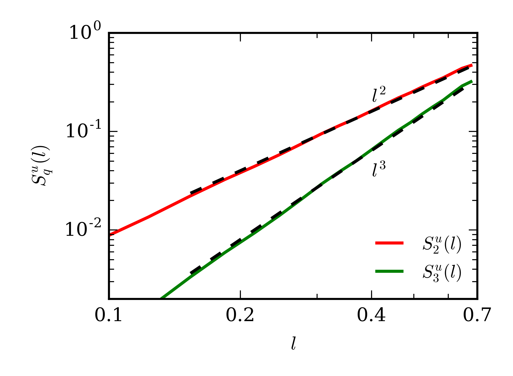
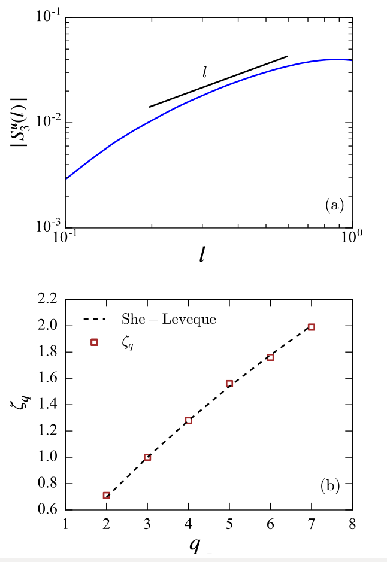

# Summary

Turbulence is a highly complex phenomenon in fluid dynamics involving nonlinear interactions between a large number of scales. Structure function is a popular diagnostics tool that is often used to quantify the state of turbulence [@Frisch:book; @Verma:book:ET].  Structure functions are two-point statistical quantities; thus, an accurate computation of these quantities requires averaging over a large number of points. However, this makes the computations very expensive and challenging. Therefore, an optimised code employing parallel computing is required for accurate computation of structure functions.  

 ``Kolmogorov41`` is a hybrid parallel code written in C++ that computes velocity and scalar structure functions using given velocity or scalar field data. This code is named after the Russian scientist Andre Kolmogorov to honour his famous works on turbulence that were carried out in 1941 [@Kolmogorov:Dissipation; @Kolmogorov:Structure]. ``Kolmogorov41`` employs a combination of distributed (MPI) and shared (OpenMP) memory parallelization [@Pacheco:book:PP]. We remark that the entire data is shared among all the MPI processes; this eliminates the need of communication between the processors. Thus, when a large number of processors are used, we save a lot of time spent on communication between the processors. 
 
 The user can choose whether the scalar or the velocity structure functions are reuqired to be computed. Further, there is a choice of the range of orders of the structure functions to be computed and also whether to use two-dimensional or three-dimensional fields. The fields are fed to the code as HDF5 files. 
 ``Kolmogorov41`` computes and stores the structure functions as functions of $l$, where $l$ is the distance between two points in the computational domains. Additionally, as per the choice of the user, the code also stores the structure functions as functions of the displacement vector $\mathbf{l}$. The latter form is useful for studying anisotropic turbulence such as stably stratified flows and rotating flows.  

# Mathematics

Let $\mathbf{u}$ and $\theta$ be velocity and scalar fields respectively. For any two points $\mathbf{r}$ and $\mathbf{r+l}$, we can define the velocity differential to be $\delta \mathbf{u} = \mathbf{u(r+l)}-\mathbf{u(r)}$. Further, we denote $\delta u_\parallel=\delta \mathbf{u}\cdot \hat{\mathbf{l}} $ as the component of the velocity differential along the vector $\mathbf{l}$, and $\delta u_\perp= \delta \mathbf{u} - \delta u_\parallel \hat{\mathbf{l}}$ as the component of the velocity differential perpendicular to $\mathbf{l}$. The longitudinal velocity structure functions of order $q$ are defined as
$$ S_q^{u_\parallel} = \langle \delta u_\parallel^q \rangle,$$ and the transverse velocity structure functions order $q$ are defined as $$ S_q^{u_\perp} = \langle \delta u_\perp^q \rangle. $$ 

Similarly, we can define the scalar differential to be $\delta \theta = \theta (\mathbf{r+l}) - \theta(\mathbf{r})$, and the scalar structure functions as $$ S_q^\theta = \langle \delta \theta^q\rangle. $$
For homogeneous turbulence, the $\mathbf{r}$ dependence vanishes and the aforementioned quantities become functions of $\mathbf{l}$ alone. If the turbulence is isotropic in addition to being homogeneous, the structure functions become functions of $l$, where $l=|\mathbf{l}|$. Note that second order velocity structure functions provide an estimate of energy in all the eddies of size $l$ or less [@Davidson:book:Turbulence]. 

# Design of the Code

``Kolmogorov41`` contains separate functions for computing scalar and velocity structure functions. Further, seperate functions are called when two-dimensional or three-dimensional fields are to be used for the computations. However, the basic design of all the functions is the same, and is described below.

`Kolmogorov41` employs six nested "for" loops for computation of structure functions using three-dimensional fields. The outer three loops describe the position vector $\mathbf{r}=(x_1,y_1,z_1)$, and the inner three describing the position vector $\mathbf{r+l}=(x_2,y_2,z_2)$. For two-dimensional fields, the code employs four nested "for" loops, with the outer two describing $\mathbf{r}=(x_1,z_1)$ and the inner two describing $\mathbf{r+l}=(x_2,z_2)$. For both the cases, the interval of the outermost "for" loop is divided among MPI processors. Using OpenMP threads, we parallelize the second "for" loop. In the innermost loop, the code computes $(\delta u_\parallel)^q$ and / or $(\delta u_\perp)^q$ for velocity structure functions, or $(\delta \theta)^q$ for scalar structure functions. For every $l$ [or $\mathbf{l}$ if $S_q(\mathbf{l})$ needs to be computed], the values of $(\delta u_\parallel)^q$, $(\delta u_\perp)^q$, or $(\delta \theta)^q$ are averaged over the entire domain. 

Using the properties of dot product, it can be shown that for longitudinal velocity structure functions, $S_q^{u_\parallel}(\mathbf{l})= S_q^{u_\parallel}(\mathbf{-l})$. If the user decides to compute only the longitudinal velocity structure functions, `Kolmogorov41` exploits the aforementioned property by not separately evaluating $S_q^{u_\parallel}(\mathbf{-l})$. This results in saving significant computational costs.    

 
#Results
We validate our code by using it to compute the structure functions for specific cases, and then comparing our results with those obtained analytically.

###Problem 1
We consider the following two-dimensional velocity and scalar fields:
$$\mathbf{u} = 
\begin{bmatrix} 
x \\ z
\end{bmatrix}, \quad \theta = x+z.
$$
For the given fields, it can be analytically shown that the longitudinal and transverse velocity structure functions and the scalar structure functions are given by 
$$S_q^{u_\parallel} = (l_x^2 + l_z^2)^{q/2} = l^q,$$
$$S_q^{u_\perp} = 0,$$
$$S_q^\theta = (l_x+l_z)^q.$$
We run ``Kolmogorov41`` to compute the velocity and scalar structure functions using the given fields of $32^2$ grid resolution. The domain size is chosen to be $1 \times 1$. The We find the structure functions to match with the theoretical values mentioned above. In Figure \ref{SFTest}, we plot the second and the third order longitudinal velocity structure functions versus $l$. Clearly, $S_2^{u_\parallel}(l)$ and $S_3^{u_\parallel}(l)$ scale as $l^2$ and $l^3$ respectively, consistent with the analytically obtained values. 

This problem is used as a test case for the validation of the code. The user is required to set the "test_switch" in the parameters file (para.yaml) to "true". On doing so, the code generates the velocity field and the scalar field as per the relation given earlier in the section. After computing the structure functions, the code computes the percentage error between the theoretical and the computed values of the structure functions. If the error does not exceed $1\times 10^{-10}$, the code is deemed to be passed.

###Problem 2
Here, we consider the classical problem of three-dimensional homogeneous isotropic turbulence. For such flows, the third-order longitudinal velocity structure functions are given by
$$S_3^{u_\parallel}(l) = -\frac{4}{5} \epsilon l,$$
where $\epsilon$ is the viscous dissipation rate [@Kolmogorov:Dissipation; @Kolmogorov:Structure]. In general case, the structure functions of order $q$ scale as $S_q^{u_\parallel}(l) \sim l^{\zeta_q}$, where the exponents $\zeta_q$ fit well with the model of @She:PRL1993.  

Using ``Kolmogorov41``, we compute the longitudinal velocity structure functions using the simulation data of three-dimensional homogeneous isotropic turbulence with Reynolds number (Re) of 5700. The simulation was performed using TARANG [@Chatterjee:JPDC2018] on a $512^3$ grid. The domain size was taken as ($2\pi \times 2\pi \times 2\pi$). 

We plot the third-order velocity structure functions versus $l$ in Figure \ref{Hydro}(a). We observe that in the inertial range ($0.2<l<0.7$), the third-order longitudinal velocity structure functions scale as $\sim l$, consistent with Kolmogorov's theory. We also plot the scaling exponents $\zeta_q$ versus $q$ in Figure \ref{Hydro}(b). The figure clearly shows that the exponents fit well with She-Leveque's model. 

The results obtained from Problems 1 and 2 thus validate ``Kolmogorov41``.  

# Acknowledgements

We thank R. Samuel and M. Sharma for their contributions in the development of ``Kolmogorov41``. Our computations were performed on Shaheen II at KAUST supercomputing laboratory, Saudi Arabia, under the project k1052. 

---

# References

