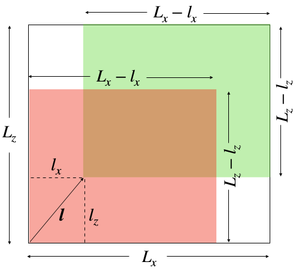

# Summary

Turbulence is a complex phenomenon in fluid dynamics involving nonlinear interactions between multiple scales. Structure function is a popular diagnostics tool to study the statistical properites of turbulent flows [@Kolmogorov:Dissipation; @Kolmogorov:Structure; @Frisch:book]. Some of the earlier works comprising of such analysis are those of @Gotoh:PF2002, @Kaneda:PF2003, and @Ishihara:ARFM2009 for three-dimensional hydrodynamic turbulence; @Yeung:PF2005 and @Ray:NJP2008 for passive scalar turbulence; @Biferale:NJP2004 for two-dimensional hydrodynamic turbulence; and @Kunnen:PRE2008, @Kaczorowski:JFM2013, and @Bhattacharya:PF2019 for turbulent thermal convection. Structure functions are two-point statistical quantities; thus, an accurate computation of these quantities requires averaging over many points. However, incorporation of a large number of points makes the computations very expensive and challenging. Therefore, we require an efficient parallel code for accurate computation of structure functions. In this paper, we describe the design and validation of the results of ``fastSF``, a parallel code to compute the structure functions of isotropic and homogeneous turbulence. 

 ``fastSF``, written in C++, employs vectorization and distributed (MPI) memory parallelization [@Pacheco:book:PP] to compute the structure functions for a given velocity or scalar field. In this code, we minimize the communication between the processors by sharing the input data in all the MPI processes. Thus, we save considerable time that would otherwise be spent on communication. The user has a choice on the type (scalar or vector) and the dimensions of the fields to be read by the code, and the range of the orders of the structure functions to be computed. The code writes the computed structure functions to `hdf5` files that can be further processed by the user.

In the next section, we will briefly define the velocity and the scalar structure functions in turbulence.

# Velocity and scalar structure functions

Let $\mathbf{u}$ and $\theta$ be velocity and scalar fields respectively. For any two points $\mathbf{r}$ and $\mathbf{r+l}$, we define the velocity differential to be $\delta \mathbf{u} = \mathbf{u(r+l)}-\mathbf{u(r)}$. Further, we denote $\delta u_\parallel=\delta \mathbf{u}\cdot \hat{\mathbf{l}}$ as the component of the velocity differential along the vector $\mathbf{l}$, and $\delta u_\perp= |\delta \mathbf{u} - \delta u_\parallel \hat{\mathbf{l}}|$ as the component of the velocity differential perpendicular to $\mathbf{l}$. Assuming statistical homogeneity, we define the longitudinal velocity structure functions of order $q$ as
$$ S_q^{u_\parallel}(\mathbf{l}) = \langle \delta u_\parallel^q \rangle,$$ 
and the transverse velocity structure functions of order 
$q$ as 
$$ S_q^{u_\perp}(\mathbf{l}) = \langle \delta u_\perp^q \rangle. $$ 

Here, $\langle \cdot \rangle$ denotes ensemble averaging. We can also define the scalar differential to be $\delta \theta = \theta (\mathbf{r+l}) - \theta(\mathbf{r})$, and the scalar structure functions (assuming statistical homogeneity) as 
$$ S_q^\theta(\mathbf{l}) = \langle \delta \theta^q\rangle. $$
If the turbulence is isotropic in addition to being homogeneous, the structure functions become functions of $l$, where $l=|\mathbf{l}|$. The second-order velocity structure function provides an estimate of energy in the eddies of size $l$ or less [@Davidson:book:Turbulence]. 

In the next section, we provide a brief description of the code.

# Design of the Code
``fastSF``  is written in C++. The code uses the Blitz++ library for vectorized array operations. The velocity structure functions ($S_q^{u_\parallel}(\mathbf{l})$ and $S_q^{u_\perp}(\mathbf{l})$) and the scalar structure functions ($S_q^{\theta}(\mathbf{l})$) are computed and stored in a Blitz array. ``fastSF`` contains separate functions for computing the scalar and the velocity structure functions. Also, separate functions are called for two-dimensional or three-dimensional input fields. However, the basic design of all the functions is the same, as described below.

Figure \ref{Schematic} exhibits a schematic diagram for the methodology to compute the structure functions. The code navigates through different points in the domain, with each point corresponding to the position vector $\mathbf{l}=(l_x,l_y,l_z)$.  As shown in Fig. \ref{Schematic}, there are two subdomains of equal dimensions (represented in green and pink colors) for every $\mathbf{l}$. The green subdomain is given by
$$D_{\mathrm{green}} = \{(x,y,z): l_x \leq x \leq L_x, l_y \leq y \leq L_y, l_z \leq z \leq L_z \}, $$
and the pink subdomain is given by
$$D_{\mathrm{pink}} = \{(x,y,z): 0 \leq x \leq L_x-l_x, 0 \leq y \leq L_y-l_y, 0 \leq z \leq L_z-l_z \}. $$
The velocity (or scalar) differential field array is computed by vectorized subtraction of the velocity (or scalar) field of the subdomain $D_{\mathrm{pink}}$ from that of the subdomain $D_{\mathrm{green}}$. The code computes $\delta U_{\parallel}^q$ and $\delta U_{\perp}^q$ arrays for every velocity differential, and then calculates the mean of these arrays to obtain the velocity structure functions. Similarly, the code computes the mean of the scalar differential array to obtain the scalar structure functions. We remark that vectorization makes the code approximately twenty times faster than what it would have been if nested `for` loops were used instead.  

The current version of ‘fastSF’ computes the structure functions correctly only for homogeneous and isotropic turbulence. This is because ‘fastSF’ computes and stores the structure functions for only the positive values of $l_x$, $l_y$, and $l_z$. Note that this still gives the correct values for isotropic turbulence because in such case, the structure functions depend only on the magnitude of $\mathbf{l}$ and not its orientation. Further, the structure functions are important for intermediate scales (inertial range) only; thus computation of these quantites for large values of $l$ is not required.
Therefore, $\mathbf{l}$ is varied up to half the domain size, ($L_x/2, L_y/2, L_z/2$), saving computational cost.

We employ Message Passing Interface (MPI) to parallelize the code.  The points ($\mathbf{l}$) of the domain are distributed among the processors along $x$ and $y$ directions for three dimensions, and along $x$ and $z$ directions for two dimensions. Each processor computes the structure functions for the points assigned to it. The input fields are accessible to all the processors to minimize the need of communication. The master processor receives the structure functions computed for different $\mathbf{l}$ from all the processors and assigns them to the appropriate index of the structure function array.

It must be noted that the size of the subdomains $D_{\mathrm{green}}$ and  $D_{\mathrm{pink}}$ varies with $\mathbf{l}$. In our code, $\mathbf{l}$'s are distributed among the processors in such a way that for every processor, the combined size of the subdomain $D_{\mathrm{green}}$  or $D_{\mathrm{pink}}$ for all the $\mathbf{l}$'s assigned to the processor is the same. This ensures that every processor gets equal load and thus enhances the scalability of the code.  

We summarize the computation procedure in the pseudo-code below, taking the example of structure functions for three-dimensional velocity field.

**Pseudo-code**

*Data*: Velocity field $\mathbf{u}$ of grid size $N_x \times N_y \times N_z$, number of processors $P$, dimensions of the domain ($L_x \times L_y \times L_z$)

*Procedure*:

* Determine the columns ($l_x, l_y$) assigned to the processor such that load is evenly distributed among the processors. 

* for every column ($l_x, l_y$) assigned to the processor:
     
    * for $l_z$:
        
        * Define $\delta \mathbf{u} = \mathbf{u}[l_x:L_x, l_y:L_y, l_z:L_z]-\mathbf{u}[0:L_x-l_x, 0:L_y-l_y, 0:L_z-l_z]$.
        
        * Compute the arrays: $\delta u_{\parallel} = \delta \mathbf{u} \cdot \hat{\mathbf{l}}$, and $\delta u_{\perp} = |\delta \mathbf{u} - \delta u_{\parallel} \hat{\mathbf{l}}$|.
        
        * for order $q$:
        
            * $S_q^{u_{\parallel}} =$ Average of $\delta u_{\parallel}^q$; $S_q^{u_{\perp}} =$ Average of $\delta u_{\perp}^q$.
            
            * Send the values of $S_q^{u_{\parallel}}$, $S_q^{u_{\perp}}$, $q$, $l_x$, $l_y$, and $l_z$ to the master processor.
            
            * If the processor is the master processor, store $S_q^{u_{\parallel}}(l_x, l_y, l_z)$, $S_q^{u_{\perp}}(l_x, l_y, l_z)$.
             
* Stop

In the next section, we discuss the scaling of our code.

# Scaling of `fastSF`

We test the scaling of `fastSF` by running it to compute the third-order longitudinal structure function for an idealized velocity field of $128^3$ grid resolution, employing a maximum of 1024 processors. The velocity field is given by $$\mathbf{u} = 
\begin{bmatrix} 
x \\ y \\z
\end{bmatrix}.$$
We perform four runs on a Cray XC40 system (Shaheen II of KAUST) for this problem using 16, 64, 256, and 1024 processors. In Fig. \ref{Scaling}, we plot the inverse of time taken in seconds versus the number of processors. The data-points follow $T^{-1} \sim p$ curve to a good approximation. Thus, we conclude that our code exhibits strong scaling. 

 
# Validation

We validate `fastSF` by comparing the numerical results with analytical results for idealized $\mathbf{u}$ and $\theta$ fields as well as with the predictions of K41 [@Kolmogorov:Dissipation; @Kolmogorov:Structure].

### Problem 1

We consider the following two-dimensional velocity and scalar fields:
$$\mathbf{u} = 
\begin{bmatrix} 
x \\ z
\end{bmatrix}, \quad \theta = x+z.
$$
For the above fields, it can be analytically shown that the longitudinal and the transverse velocity structure functions and the scalar structure functions are
$$S_q^{u_\parallel} = (l_x^2 + l_z^2)^{q/2} = l^q,$$
$$S_q^{u_\perp} = 0,$$
$$S_q^\theta = (l_x+l_z)^q.$$
We run ``fastSF`` to compute the velocity and scalar structure functions for the above fields. The resolution of the fields and the domain size are $32^2$ and $1 \times 1$ respectively. We plot the second and the third-order longitudinal velocity structure functions versus $l$ in Fig. \ref{SFTest}. Clearly, $S_2^{u_\parallel}(l)$ and $S_3^{u_\parallel}(l)$ equal $l^2$ and $l^3$ respectively, consistent with the analytical results. Figure \ref{SFScalar} exhibits the density plots of the computed second-order scalar structure function $S_2^{\theta}(\mathbf{l})$ along with $(l_x + l_z)^2$. The two plots are very similar, thus showing the ``fastSF`` computes the scalar structure function correctly.

The above problem is used as a test case for the the code. The user is required to execute the shell script `fastSF/runTest.sh` to run the test case. On doing so, the code generates the velocity and the scalar fields as per the above relation. After computing the structure functions, the code computes the percentage difference between the theoretical and the computed values of the structure functions. If the error does not exceed $1\times 10^{-10}$, the code is deemed to have passed.

### Problem 2

Here, we consider the classical results of Kolmogorov [@Kolmogorov:Dissipation; @Kolmogorov:Structure] for three-dimensional incompressible homogeneous isotropic turbulence. In such flows, for the inertial range, which comprises of scales lying between the large-scale forcing regime and the small-scale dissipation regime, the third-order longitudinal velocity structure function is given by
$$S_3^{u_\parallel}(l) = -\frac{4}{5} \epsilon l,$$
where $\epsilon$ is the viscous dissipation rate [@Kolmogorov:Dissipation; @Kolmogorov:Structure; @Frisch:book; @Verma:book:ET]. For an arbitrary order $q$, @She:PRL1994 proposed that the longitudinal structure functions scale as $S_3^{u_\parallel}(l) \sim l^{\zeta_q}$, where the exponent $\zeta_q$ is given by 
$$ \zeta_q = \frac{q}{9} + 2 \left ( 1 - \left ( \frac{2}{3} \right )^{q/3} \right ).$$ 

We compute the longitudinal velocity structure functions of $q=3,5,7$ using the simulation data of three-dimensional homogeneous isotropic turbulence with Reynolds number (Re) of 5700. The simulation was performed using TARANG [@Verma:Pramana2013tarang; @Chatterjee:JPDC2018] on a $512^3$ grid with the domain size of ($2\pi \times 2\pi \times 2\pi$). For more details on the simulation, refer to @Sadhukhan:PRF2019. We run ``fastSF`` on Shaheen II to compute the structure functions, employing 4096 MPI processes. 

We normalize the third, fifth, and seventh-order longitudinal velocity structure functions with $(\epsilon l)^{\zeta_q}$, where $\zeta_q$ is given by She-Leveque's relation. We plot the negative of these quantities versus $l$ in Fig. \ref{Hydro}. 
The figure clearly shows that in the inertial range ($0.2<l<0.8$), the normalized third-order longitudinal velocity structure function is fairly close to $4/5$ (represented by dashed line), consistent with Kolmogorov's theory. Moreover, the normalized fifth and seventh-order structure functions show a plateau for the same range of $l$, thus exhibiting consistency with She-Leveque's model. Note that we expect more accurate results for higher resolution simulations [@Verma:Pramana2013tarang].

The results obtained from Problems 1 and 2 thus validate ``fastSF``. 

# Conclusions

This paper describes the design and the validations of ``fastSF``, a parallel C++ code that computes structure functions for given velocity and scalar fields. We validate ``fastSF`` using two test cases. In the first case, we compute the structure functions using hypothetical velocity and scalar fields, and find them to be consistent with analytical results. In the second case, we compute the velocity structure functions using the fields obtained from the simulations of three-dimensional homogeneous and isotropic turbulence, and show consistency with Kolmogorov's K41 result. We believe that ``fastSF`` will be useful to turbulence community.  

# Acknowledgements

We thank R. Samuel, A. Chatterjee, S. Chatterjee, and M. Sharma for useful discussions during the development of ``fastSF``. Our computations were performed on Shaheen II at KAUST supercomputing laboratory, Saudi Arabia, under the project k1416. 

---

# References

